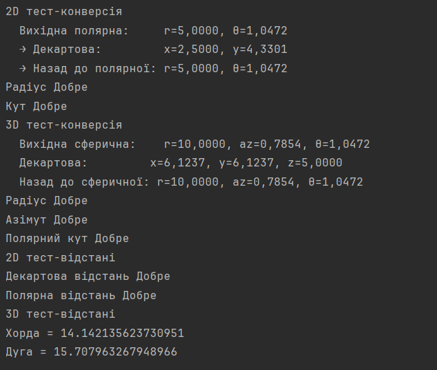
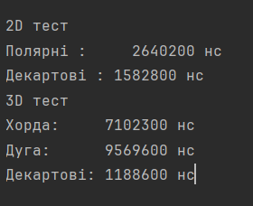

Мета роботи:  попрацювати з перетворенням точок з 2D у 3D системах координат.
Вивчити та створити методи перетворення між декартовою, сферичною та полярною системами координат.
Попрацювати з імутабельністю класів

Запуск та залежності:
З потрібних залежностей - це тільки 21 версія Java
Запуск відбувається таким чином:
Відкривається проєкт у IntelliJ IDEA та запускається клас Main

Результати роботи :
2D: 
Полярна точка (r=5.0, θ=1.0472 рад) 
Декартова (x=2.5000, y=4.3301), назад (r=5.0000, θ=1.0472)
Збіг існує

3D: 
Сферична точка (r=10.0, az=0.7854, θ=1.0472)
Декартова (x=6.1237, y=6.1237, z=5.0000), назад (r=10.0000, az=0.7854, θ=1.0472)
Збіг існує

<h2>Результати бенчмаркінгу</h2>
<table>
  <thead>
    <tr>
      <th>Підхід</th>
      <th>Час (нс)</th>
      <th>Час (мс)</th>
    </tr>
  </thead>
  <tbody>
    <tr><td>2D Полярні</td><td>2 640 200</td><td>2.64</td></tr>
    <tr><td>2D Декартові</td><td>1 582 800</td><td>1.58</td></tr>
    <tr><td>3D Хорда</td><td>7 102 300</td><td>7.10</td></tr>
    <tr><td>3D Дуга</td><td>9 569 600</td><td>9.57</td></tr>
    <tr><td>3D Декартові</td><td>1 188 600</td><td>1.19</td></tr>
  </tbody>
</table>

Результати тестів:
Аналіз 2D:
Декартовий підхід швидший у 1.67 рази
Полярна формула вимагає виклику cos тригонометрична функція суттєво дорожча за просту арифметик
Декартова формула використовує лише множення, додавання та один sqrt

Аналіз 3D:
Декартовий підхід найшвидший у 6 разів швидше за хорду та 8 разів швидше за дугу
Хорда вимагає 4 тригонометричних виклики (sin/cos) та sqrt
Дуга найповільніша: ті самі виклики та додатковий acos для центрального кута 

<h2>Скріншоти</h2>

  

Висновок: під час виконання даної роботи було отримано розуміння того, як створювати імутабельні класи,
як перетворювати координати між різними системами координат тощо. Також зрозумів, наскільки сильно
впливає на швидкодію програми використання таких функцій як: sin, cos, acos тощо
